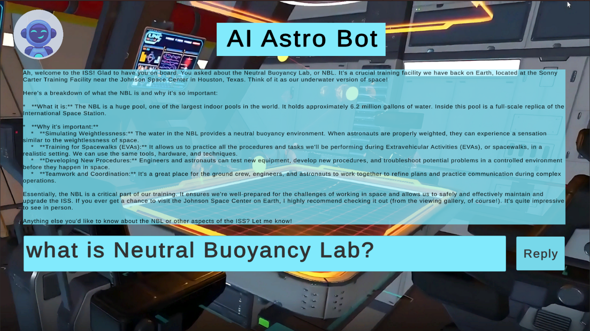

## Dream 2050 – Team Titan

*"Dream has no fear. Space is not out of reach."*

Dream 2050 is an ambitious **Virtual Reality (VR) simulation** created to celebrate the **25th Anniversary of the International Space Station (ISS)**.
Our vision extends to **2050**, promoting global participation in space exploration by bringing the authentic astronaut experience directly to everyone.

The project bridges the gap between **limited ISS access** and **seamless global access**, powered by:

* **Blender** (3D modeling)
* **Unity** (game engine, C# scripting)
* **NASA Open Data**
* **Gemini AI API** (intelligent assistance and contextual guidance)

---

## Project Demonstration
Our VR simulation offers an authentic astronaut experience through the Cupola Photography Mode (linked to real NASA climate data) and a Weightless Mission Mode that replicates NBL training.
The Gemini AI Astro Bot Assistant provides real-time, data-backed guidance, transforming passive viewing into an active journey of skill development and planetary awareness.

[Watch on YouTube](https://youtu.be/jWjH_fgH-UA?si=-G1NtQi7OCT6Zw5t)


---

## UnityAndGeminiV3.cs - AI Astrobot Integration

This script integrates Google's **Gemini AI** with Unity for:

- Conversational AI  
- Image generation  
- Multimedia analysis capabilities  

### How to Run Locally

1. **Get a Gemini API key**, then create a `gemini_api.json` file in your Unity project's `Assets/Resources` folder with the format:  
   ```json
   { "key": "YOUR_API_KEY" }
2. Add the `UnityAndGeminiV3.cs` script to an empty GameObject in your scene.
3. Assign the JSON file to the script's JSON API field in the Inspector.
4. For chat functionality:
* Create TextMeshPro Input Field and Text components.
* Assign them to the script's Input Field and UI Text fields in the Inspector.
5. (Optional configurations):
* Bot Instructions → Customize AI behavior.
* Image Prompt → Generate skyboxes.
* Media File Path & Media Prompt → Analyze videos, audio, PDFs, or images (max 20MB).
6. Press Play ▶ to start interacting with the AI.

### Astrobot Conversational UI: 
<p align="center">  </p>

---

## Project Summary

Dream 2050 goes beyond passive viewing — it is an **active astronaut journey** that:

* Simulates **Cupola Earth photography** linked to real NASA data.
* Recreates **Neutral Buoyancy Lab (NBL) training** with physics-based microgravity drift.
* Integrates the **AI Astro Bot Assistant**, which serves as a multilingual (Bangla & English) mission control guide.

Through these immersive experiences, users learn **problem-solving, teamwork, planetary care**, and the real significance of space exploration for life on Earth.

---

## Core Components

### 1. Cupola Photography Mode (Earth Observation)

* Sit inside the ISS Cupola.
* Capture images of Earth (storms, climate markers, coastlines, forests).
* Each photo dynamically links to **real NASA data**, teaching its role in disaster response, climate monitoring, and Earth studies.

### 2. Weightless Mission Mode (NBL Training)

* Physics-based **microgravity drift simulation**.
* Perform astronaut tasks: solar panel repair, plant growth experiments, and emergency response.
* Inspired by NASA’s **Neutral Buoyancy Lab training**.

### 3. AI Astro Bot Assistant

* Powered by **Gemini AI API**.
* Functions as a **personal mission control** in the user’s ear.
* Provides **data-backed guidance** and **Q&A support** on ISS, space science, and NASA initiatives.
* Supports **Bangla & English** for inclusive access.

---

## Benefits of Our Solution

* **Authentic Immersion**: Users live the astronaut life, not just watch it.
* **Skill Development**: Learn teamwork, problem-solving, patience, and planetary care.
* **Data-Driven Learning**: Links actions (like photography) to **real-world scientific impact**.
* **Accessibility & Inclusion**: Future updates will add **cross-platform support** and classroom-friendly versions.

---

## Our Goal

Our goal is to transform the **passive consumption of space content** into **active engagement**.
By combining **VR, physics simulation, and AI guidance**, Dream 2050 shows that:

* Space is **not out of reach**.
* The skills astronauts need are the same skills we need on Earth.
* Every mission connects directly to **planetary care**.

We aim to inspire **global contribution to space exploration by 2050**.

---

## Tools & Technologies

* **Unity (C#)** – game engine & scripting
* **Blender** – 3D modeling
* **NASA Open Data** – real datasets & imagery
* **Gemini AI API** – contextual guidance & intelligent assistant

---

## Use of AI

* ChatGPT
* Gemini
* Canva
* Veo3

---

## Challenges

* Realism vs. Accessibility – Making the ISS & NBL experience scientifically accurate yet lightweight and device-friendly.
* Data & Asset Integration – Curating massive NASA imagery/video into optimized, interactive formats.
* Interactivity & Engagement – Balancing astronaut training realism with fun, short missions for students.
* Multi-Mode Design – Seamlessly linking Cupola visuals with NBL weightlessness without breaking immersion.

---

## Solution

Team Titan from Bangladesh created Dream 2050: ISS VR + AI Experience, an immersive simulation that transforms astronaut experiences into an interactive learning journey.

* Cupola Mode lets users look through ISS windows, capture Earth photos, and link them to real NASA datasets on storms, forests, cities, and climate change.
* Weightless Mission Mode recreates microgravity, where users float, repair solar panels, unload cargo, grow plants, and handle emergencies as astronauts train in the NBL.
* AI Astro Bot Assistant acts as mission control—guiding users, answering questions with real NASA data, and turning the VR simulation into an educational companion.


---

## Impact

* Educational Access: Makes astronaut experiences available to students, classrooms, and the public—breaking geographic and resource barriers.
* Earth Connection: Shows how Cupola photography aids disaster response and climate research, and how NBL-style teamwork applies to hospitals, factories, and schools.
* STEM Inspiration: Sparks curiosity about science, technology, and space exploration—encouraging future scientists and innovators.
* Emotional Resonance: Builds empathy for Earth by letting people feel the silence, fragility, and awe of space.
---


## References

* [NASA Open Data Portal](https://data.nasa.gov/)
* [Unity](https://unity.com/)
* [Blender](https://www.blender.org/)

---

## Acknowledgments

Thanks to **NASA Space Apps Challenge 2025**, open-source communities, and all contributors for inspiring innovation.

---
